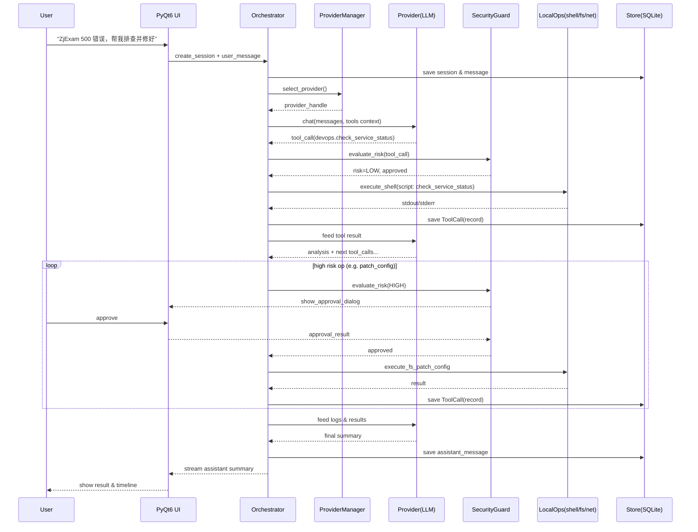

## 1. 产品定位：从“大而全控制台”收缩到“1–2 个标志性场景”

现在定位有点泛：

> “一个窗口，统一调用 AI & 工具 & 本机能力”

对你自己来说，这句话是准确的，但对未来的用户（包括未来的你）不够锋利。建议：

### 1.1 明确核心人群 =「高级开发 + 运维/网工 + 重度 AI 用户」

结合你日常使用场景，你真正要服务的是：

* 会写脚本、懂命令行，但嫌麻烦的人
* 经常开一堆 agent / CLI / 网页（OpenAI 网页、Claude、Kimi、Ollama、WireGuard 管理、路由脚本……）的人
* 在本机上有很多“半自动化流程”（抓包、改路由、查日志、重启服务、跑脚本）的人

### 1.2 收敛成 1–2 个「杀手级路径」

建议给 YFAI 明确一个 slogan 级的主线，例如类似：

* 「把本机当成一台带 LLM 的自动化服务器」
* 「用对话+命令面板操作你的开发环境和系统」

然后挑 1–2 个你**真的每天会用**的场景，做成“金路径”：

**候选金路径示例：**

1. **DevOps 金路径：**
   
   * 在一个对话里：
     “帮我拉起 ZjExam 的本地环境 → 看下容器状态 → tail 错误日志 → 分析错误 → 给修复建议 → 帮我改对应配置/代码文件（需要审批）→ 重启服务 → 验证 HTTP 健康检查”
   * 这个路径串起来：LocalOps(fs + shell + net) + MCP(devops server) + Provider + 审批 + 日志。

2. **网络/路由金路径：**
   
   * “查看当前 WireGuard 状态 → 把 X 域名的路由切到物理网卡 → 验证连通性 → 持久写入 route + 记录变更原因”
   * 你已经在频繁手工做这些；把它变成「一键剧本 + LLM 辅助解释」是非常有卖点的。

你的设计已经有所有零件，差的是：**挑一个故事，把零件锁成一条体验链**。
建议在 `docs/设计文档.md` 顶部加一节《金路径示例》，画顺序图 / 步骤列表。

---

## 2. 架构层面：现在模块划分 OK，但需要“统一抽象 + 简化流转”

总体架构（PyQt6 UI → Orchestrator → Providers/MCP/LocalOps → Store + Security）是对的。可以重点打磨几件事：

### 2.1 统一 “工具” 抽象（MCP + LocalOps + 将来更多）

现在有：

* MCP 工具：通过 `McpRegistry` + `McpClient`
* LocalOps：fs/shell/process/net 等本地方法
* Provider 本身也有 tool calling（如 DashScope function calling）

建议把这些 **在 Orchestrator 层合成一种统一的 `ToolDescriptor` 结构**，包括：

* `id/name`（全局唯一），`source`（`mcp` / `local` / `provider_fn`）
* `risk_level` / `approval_required`
* 参数 schema（简单可以先描述成 JSON Schema / Pydantic model）
* 返回类型

这样 Orchestrator 不关心“是 MCP 还是 LocalOps”，只认“工具列表 + 风险等级 + 权限策略”。
UI 的 ToolsPanel 也只绑定这一个统一列表，自动带颜色和风险提示。

**直接收益：**

* 以后新增一个 MCP server / 新的 LocalOps，只是多了几条 `ToolDescriptor`；
* 对 LLM 暴露工具时，也可以统一拼 tool 列表做 function calling 提示词。

### 2.2 Orchestrator 再拆一层事件/任务总线

当前 Orchestrator 已经兼顾：

* 创建会话、保存消息
* 调用 Provider（含流式）
* 调用工具 + 审批 + 写 ToolCall 记录
* 健康检查

建议逻辑上拆成两个角色（代码可以先不拆文件，先拆类也行）：

1. **ConversationService**：只管会话与消息（存取、构造上下文、标记状态）
2. **ExecutionService / TaskBus**：只管执行“任务”（LLM 调用、工具调用、审批流）

UI 层向下发的永远是“任务”（例如 `RunChatCompletion`, `RunTool`, `HealthCheck`），
Store 负责记录“任务和其结果”，审计更清晰。

中长期如果你搞“后台流程 / 自动任务”，这层会非常重要。

### 2.3 Qt + asyncio 协作策略要提前定死

你选了 PyQt6 + asyncio/httpx，这是好事，但坑很多。建议一开始就定一个官方做法：

* 要么全局使用 **`qasync`**，把 asyncio loop 和 Qt event loop 合并；
* 要么所有异步调用在后台线程跑一个 event loop，主线程只收信号/回调。

不要让随机的 `asyncio.run()`、`loop.run_until_complete()` 混在 UI 线程里，否则后期 debug 会很痛苦。

---

## 3. 安全 & 审批：把“安全感”做成卖点，而不是负担

你在安全治理上其实已经做得很超前（风险枚举、审批、路径白名单、脱敏规则…）。
建议再往“可用性 + 产品化”上推一步：

### 3.1 做一个「安全模式层级」概念

比如：

* **严格模式（默认）**：
  
  * 所有 `WRITE/DELETE/执行脚本/网络敏感操作` 必须弹审批
  * 不允许 LLM 连续执行多步危险操作

* **信任模式（单会话/单场景）**：
  
  * 针对某些工具（例如只读日志、只读数据库）可以提前“预授权”
  * 审批弹窗可以合并为“一次批准本会话内对此工具的调用”

在 Settings 或审批弹窗里清晰地说明当前模式，有助于你以后给别人演示/交付时形成“卖点”。

### 3.2 审计视图：时间线 + Diff

既然 Orchestrator 里已经写 ToolCall 记录和 stdout/stderr：

* 建议 UI 提供一个 **“安全审计时间线”**：
  
  * 按时间列出：聊天 / 工具调用 / 审批 / 错误
  * 对涉及文件写入的操作，记录 **内容摘要 + 路径 + diff 链接**（如果成本大，先记录备份路径即可）

这会在你以后排错（“昨天我让它改了哪个配置？”）时非常有用，也能展示产品的专业度。

---

## 4. UI/交互：少而精，先把“对话 + 命令面板 + 工具审批”打磨好

现在 UI 规划很丰富（助手管理、知识库、工具/日志/设置等）。建议迭代顺序：

### 4.1 MVP 只做 3 个主入口

1. **对话页（主界面）**
   
   * 左：会话列表 + Provider 切换
   * 中：对话 + 流式渲染
   * 右：ToolsPanel（工具搜索 + 点击插入调用 / 显示风险）

2. **命令面板（Ctrl+K / Cmd+K）**
   
   * 可以触发：新建对话、切 Provider、运行常用工具脚本、打开某个设置
   * 对于重度用户，这比侧边栏点来点去高效得多

3. **审批弹窗**
   
   * 统一所有危险操作的交互（包括 MCP + LocalOps）
   * 显示：工具名 + 参数摘要 + 风险级别 + 可能影响（例如：将修改文件 X，将执行 shell 命令 Y）

其它模块（知识库、日志、助手管理）可以先做“最低可用版本”，UI 不用太花。

### 4.2 少做“炫 UI”，多做“工作流状态可见”

例如，在对话区：

* 当 LLM 决定调用工具时，在气泡里清楚显示：
  “正在调用：重启 Docker 服务（等待审批）”
* 审批通过后，再显示：
  “✅ 已执行：重启 Docker 服务，耗时 3.2s，返回：……（可展开）”

这比花时间在主题/动画上更能提升实际使用体验。

---

## 5. 数据 & 知识库：先服务好“个人文档 + 项目代码”两类

你已经有：

* SQLite 全量模型（Session/Message/ToolCall/KB/块/KV）
* FAISS Indexer + 配置化分块、top-k、相似度阈值

建议**第一阶段只支持两类知识源**：

1. **本机项目文档/代码库（你自己的 ZjExam / E-Voice / YFAI 本身）**
   
   * 支持选目录 → 自动扫描 markdown/docx/pdf/+代码文件（有限的类型）→ 分块索引 → 用特定助手做问答：
     
     * “帮我解释这个模块的架构”
     * “找到和 'route management' 相关的所有代码文件并总结”
   
   * 这是你日常非常刚需的。

2. **个人笔记/决策记录**
   
   * 比如你关于路由、WireGuard、FRP 的各种经验，可以汇总成 KB；
   * Long-term 可以在 LocalOps 中把某些操作“记录成剧本”，同时写入 KB，供 LLM 以后复用。

不必一上来就搞爬虫、数据库接入等复杂场景，否则容易失控。

---

## 6. 路线图建议：按“能自用 + 能 demo + 能扩展”排优先级

基于你现在已经实现的模块，我给一个**很务实的 3 步路线**（可以对照 `docs/设计文档.md:176` 调整）：

### Step 1：个人开发/运维助手 MVP

**目标**：你每天真在用，能替代一部分手工脚本 + 记事本 + 命令行操作。

必做：

* 稳定的 “对话 + Provider 切换 + 流式输出”
* LocalOps：文件读写（白名单）、shell 执行（含 WSL）、简单进程查看
* 基本 SecurityGuard + 审批弹窗
* Tool 抽象统一（哪怕 schema 先写死）
* 基本日志/审计列表（不要求炫 UI）

金路径：

> “帮我启动 X 项目并检查服务状态，如果失败就帮我查日志和建议修复步骤”

### Step 2：网络 & 路由场景 + 命令面板

**目标**：把你最常做的路由/WG/FRP/隧道操作脚本化 + UI 化，并通过命令面板/自然语言触发。

必做：

* LocalOps.net 补充一些你常用的操作（路由表读取、目标 IP 连通性、简单防火墙端口探测）

* 做一组 **预置剧本**（可以挂在 MCP server，也可以直接写 LocalOps 组合），例如：
  
  * “把 pypi.org 强制走 IPv4 & 物理网卡，并验证”
  * “检查 WireGuard 当前的吞吐和 MTU 问题”

* 命令面板接这些剧本为快捷项

这一步完成后，你就有了一个**“有明显差异化”的个人工具**：

> 去市面上找不到一个能理解你网络环境 + 自动操作 Windows 路由的 AI 工具。

### Step 3：知识库 & 插件生态雏形

**目标**：在你自己的项目/笔记上实现一个 RAG + 工具整合的“本地 AI 助手”。

必做：

* 简单 KB UI：选目录 → 索引 → 列出条目数量/向量数量；
* 对话时可以选择“关联某个 KB”；
* 文档里整理一份“如何写一个新的 MCP server / LocalOps 扩展”的模板，这就是将来的“插件系统起点”。

---

## 7. 一些可以立即改进的小点（非常具体）

1. **在 `configs/config.example.yaml` 里引入“profile”概念**：
   
   * `profile: { name: "home", env: "personal" }`
   * 以后可以切换不同配置（公司机 / 个人机）。

2. **给 ToolCall 记录增加 `correlation_id`**：
   
   * 把一次对话中 LLM 发起的多次工具调用关联起来，审计界面可按“链路”查看。

3. **对 LocalOps.shell 增加安全模式限制**：
   
   * Default 禁用 `rm`, `del`, `format` 等危险命令；
   * 必须通过显式“高风险模式”或审批才允许。

4. **在 README 顶部补一节「目标用户 & 核心场景」**：
   
   * 3–5 行话就够，用于对外分享；
   * 也帮你自己持续校准，不被功能清单牵着走。

5. **提前定好日志格式（机器可解析）**：
   
   * 比如所有操作日志都用 JSON Lines（字段固定：`ts`, `type`, `session_id`, `tool_id`, `result`, `risk`…）。
   * 未来想做可视化、统计、甚至接 Grafana 都会很顺。

好，那我直接给你两份可以落盘的东西：

1. 一条完整的 DevOps 金路径交互脚本 + 技术流（可进 `docs/usecases/devops_mvp.md`）
2. 一份 Orchestrator + Tool 抽象重构任务清单（可拆成 issues）

---

## 一、DevOps 金路径：本地项目一键排错流程

### 1. 场景概述（可以写进文档开头）

> 目标：在 YFAI 中，通过对话 + 工具调用，以最少的手工操作完成一次完整的「本地服务异常排查 + 修复 + 验证」流程。
> 参与项目：以 `ZjExam` 为例（或任何本地 Web 服务）。

### 2. 参与组件（映射到你现有模块）

* UI：
  
  * `ChatWidget`：主对话区（自然语言交互）
  * `ToolsPanel`：显示 “DevOps 剧本” 工具（如：`devops.check_status`, `devops.tail_logs`, `devops.restart_service`）
  * 审批弹窗：危险操作（重启/修改文件等）

* 核心：
  
  * `Orchestrator` / 未来的 `ExecutionService`：调度 Provider + LocalOps + MCP
  * `ProviderManager`：选择 LLM（如 `bailian` 或 `ollama`）
  * `SecurityGuard` + `SecurityPolicy`：风险判定 + 审批调度

* 工具：
  
  * LocalOps.shell：执行 docker/docker-compose/systemctl/自定义脚本
  * LocalOps.fs：读取配置文件/日志
  * LocalOps.net：HTTP 健康检查
  * （可选）MCP.devops：把常用操作封装成 MCP 工具暴露

---

### 3. 用户视角交互脚本（可直接拷到文档）

#### Step 0：选择场景 / 预设模板

* 用户从命令面板或 ToolsPanel 选择：
  
  > 「DevOps：排查本地 Web 服务故障」

* 系统在对话窗口注入系统提示（可隐藏）：
  
  > “这是一个 DevOps 故障排查会话，目标是恢复项目 `ZjExam` 的 Web 服务可用。请逐步执行：
  > 
  > 1. 检查容器/进程状态 →
  > 2. 检查端口与 HTTP 健康 →
  > 3. 如异常，读取最近日志 →
  > 4. 结合日志分析提供修复建议 →
  > 5. 经审批后修改配置或重启服务 →
  > 6. 重新验证服务状态。”

#### Step 1：用户触发

* 用户输入：
  
  > “ZjExam 今天访问 500 错误，帮我排查并修好。”

* 系统行为：
  
  * Orchestrator 创建新会话，标记 `scenario=devops_zjexam`
  * 选定 Provider（如 `bailian`，失败则降级到 `ollama`）

#### Step 2：检查服务/容器状态

* LLM 规划步骤后，调用工具（由系统自动触发，用户可见）：
  
  * 工具：`devops.check_service_status`（本质是 LocalOps.shell 运行你的脚本）
  
  * 命令示例（脚本内部）：
    
    * `docker compose ps` 或 `systemctl status zjexam.service` 或 `ps aux | grep zjexam`

* UI 表现（在对话里插入工具调用气泡）：
  
  > 「正在检查 ZjExam 服务状态…」

* 执行结果（写入 ToolCall + 审计）后，LLM 总结给用户：
  
  > “ZjExam 的后端容器正在运行，但 `web` 容器处于 `Restarting` 状态，重启次数较多。”

#### Step 3：检查端口和 HTTP 健康

* LLM 再发起工具调用：
  
  * `devops.check_port`（LocalOps.net：检查端口开放）
  * `devops.http_health_check`（LocalOps.net：GET `http://localhost:8080/health`）

* UI 状态：
  
  > 「正在检查 8080 端口与 HTTP 健康接口…」

* 结果被总结：
  
  > “8080 端口可以连接，但 `/health` 返回 500，错误信息包含 `database connection refused`。”

#### Step 4：拉取最近错误日志

* LLM 请求读取日志：
  
  * `devops.tail_error_log` → LocalOps.fs + LocalOps.shell
    
    * 例如：`tail -n 200 /var/log/zjexam/error.log` 或 `docker logs web --tail=200`

* 安全策略：
  
  * 只读操作，风险可标记为 `LOW`，默认自动通过审批。

* UI：
  
  > 「已读取最近 200 条错误日志，正在分析……」

* LLM 分析日志，将关键错误摘要化：
  
  > “日志显示数据库地址从 `10.0.0.10` 改成了 `10.0.0.11`，但应用配置依然指向旧地址，导致连接失败。”

#### Step 5：生成修复方案 + 变更预案

* LLM 输出两部分内容：
  
  1. **解释：** 问题原因 + 风险点
  
  2. **计划：** 下一步操作列表，如：
     
     * 备份当前配置文件
     * 修改配置中的 DB 地址
     * 重启服务
     * 再次做健康检查

* 用户确认：
  
  > “按你说的执行吧。”

#### Step 6：配置修改（高风险，需要审批）

* 工具调用流程示例：
1. `devops.backup_config`
   
   * LocalOps.fs：复制 `config.yaml` → `config.yaml.bak_YYYYMMDDHHMM`
   * 风险等级：`MEDIUM`（写操作） → 弹审批

2. `devops.patch_config`
   
   * LocalOps.fs：精确替换配置内容（如通过简单 YAML 修改脚本）
   
   * 风险等级：`HIGH` → 审批弹窗必须展示：
     
     * 文件路径
     * 修改前后 diff（尽量）
* 审批弹窗内容示例：
  
  * 标题：`[高风险操作] 修改配置文件`
  
  * 内容：
    
    * 文件：`/etc/zjexam/config.yaml`
    * 变更：`db.host: 10.0.0.10 → 10.0.0.11`
    * 关联会话：`#1234`
  
  * 按钮：拒绝 / 仅本次允许 / 本会话内允许此工具

#### Step 7：重启服务 + 验证

* 工具：
  
  * `devops.restart_service`（LocalOps.shell）
    
    * `docker compose restart web` 或 `systemctl restart zjexam`
  
  * 再次调用 `devops.http_health_check`

* 结果反馈：
  
  > “已重启 ZjExam 服务，/health 返回 200。建议你在浏览器访问一次确认。”

#### Step 8：记录总结 & 审计

* LLM 输出最终报告：
  
  > “本次故障原因：DB IP 变更导致连接失败。
  > 采取操作：备份配置 → 修改配置 → 重启服务 → 验证健康。
  > 建议：将 DB 地址改为环境变量，避免硬编码。”

* 后台：
  
  * 把该会话标记 `resolved=true`
  * 写入 `resolution_summary`、`root_cause` 字段
  * 工具调用链路全部挂 `correlation_id`，供日志界面查看。

---

### 4. 技术流转（Mermaid 顺序图示例）

可以放到 `docs/usecases/devops_mvp.md`：

---

### 5. 数据/审计字段建议

给 `ToolCall` / `Session` 增加/确认字段：

* ToolCall：
  
  * `id`
  * `session_id`
  * `correlation_id`（一次排障链路）
  * `tool_id`（如 `devops.check_service_status`）
  * `source`（`local`, `mcp`, `provider_fn`）
  * `risk_level`（enum）
  * `approval_status`（`PENDING/APPROVED/REJECTED/AUTO_APPROVED`）
  * `approval_by`
  * `request_payload`
  * `response_payload`
  * `stdout`
  * `stderr`
  * `started_at`
  * `finished_at`
  * `error`

* Session：
  
  * `scenario`（`devops_zjexam`）
  * `resolved`（bool）
  * `root_cause`（短文本）
  * `resolution_summary`（长文本）
  * `last_tool_correlation_id`

---

## 二、Orchestrator & Tool 抽象重构任务清单

下面可以直接变成 GitHub issues 或 `docs/roadmap/orchestrator_refactor.md`。
我按“EPIC → 任务”给。

### EPIC A：统一 Tool 抽象

**目标：** MCP 工具 + LocalOps + Provider function calling 都抽象成统一 `ToolDescriptor`，供 Orchestrator & UI 使用。

#### A1. 定义 ToolDescriptor 模型

* 新建 `yfai/core/tools.py`：
  
  * `ToolSource` 枚举：`LOCAL`, `MCP`, `PROVIDER_FN`
  
  * `RiskLevel` 枚举复用 `SecurityGuard`
  
  * `ToolDescriptor`：
    
    * `id: str`（全局唯一，建议 `source:name`）
    * `name: str`
    * `source: ToolSource`
    * `title: str`
    * `description: str`
    * `risk_level: RiskLevel`
    * `approval_required: bool`
    * `params_schema: dict | JSONSchema`（先用 dict）
    * `returns_schema: dict | None`
    * `meta: dict`（如 MCP server 名、本地实现函数路径）

#### A2. MCP → ToolDescriptor 适配层

* 在 `McpRegistry` 增加方法：
  
  * `list_descriptors() -> list[ToolDescriptor]`

* 根据 YAML 中的 MCP server 配置：
  
  * 读取 MCP tools 列表
  * 结合你已有的“风险映射”，填充 `risk_level` / `approval_required`

* 把原来直接使用 MCP 工具的地方替换为通过 `ToolDescriptor` 访问。

#### A3. LocalOps → ToolDescriptor 适配层

* 在 `localops` 里为每个操作定义元数据（可以集中在一个配置里）：
  
  * 例如在 `configs/tools.local.yaml` 或 Python dict：
    
    * `fs.read_file`, `fs.write_file`, `shell.run`, `net.http_get`, `process.kill` …
  
  * 每项指定：`risk_level`、白名单要求等

* 新增 `LocalOpsRegistry`：
  
  * `list_descriptors()`
  * `execute(tool_id, args)`

#### A4. Provider function calling → ToolDescriptor（可后做）

* 如果你用 DashScope 的工具调用，可以把 function schemas 也映射成 `ToolDescriptor`。
* 这一步可以先放 TODO，不影响 MVP。

#### A5. Orchestrator 只接收 ToolDescriptor，不直接区分来源

* 调整 Orchestrator 的工具执行路径：
  
  * 输入：`tool_id` + `args`
  * 内部：通过统一 `ToolRegistry` 找到 descriptor + executor（MCP/LocalOps/Provider）
  * 把 `source`、`risk_level`、`approval_required` 都从 descriptor 取

---

### EPIC B：拆分 ConversationService / ExecutionService

**目标：** 降低 Orchestrator 混合职责，把“会话管理”和“任务执行”解耦，方便后续扩展自动任务、计划任务。

#### B1. 新建 ConversationService

* 类文件：`yfai/core/conversation.py`

* 职责：
  
  * `create_session(scenario: str | None)`
  * `append_message(session_id, role, content, metadata)`
  * `get_history(session_id, limit: int | None)`
  * `mark_resolved(session_id, root_cause, resolution_summary)`

* 内部只操作 `DatabaseManager` & ORM 模型，**不**直接调用任何工具/Provider。

#### B2. 新建 ExecutionService / TaskBus

* 类文件：`yfai/core/executor.py`

* 定义任务模型 `ExecutionTask`：
  
  * `id`
  * `type`：`CHAT_COMPLETION`, `TOOL_CALL`, `HEALTH_CHECK` …
  * `session_id`
  * `payload`（如 messages / tool_id+args）
  * `status`：`PENDING/RUNNING/DONE/FAILED`
  * `result` / `error`

* 提供方法：
  
  * `run_chat(session_id, messages, tools_ctx) -> stream / result`
  * `run_tool_call(session_id, tool_id, args)`
  * `run_health_check()`

* 负责：
  
  * 调用 `ProviderManager`
  * 调用统一 ToolRegistry
  * 与 `SecurityGuard` 交互
  * 写入 ToolCall 记录

#### B3. Orchestrator 变成薄门面

* `Orchestrator` 保留在 `yfai/core/orchestrator.py`：
  
  * 对 UI 提供统一 API：
    
    * `send_message(session_id, content, ...)`
    * `invoke_tool_from_ui(tool_id, args, session_id)`
    * `get_health_status()`
  
  * 内部委托：
    
    * 会话相关 → `ConversationService`
    * 执行相关 → `ExecutionService`

---

### EPIC C：Task/流式输出与事件模型

**目标：** 明确 UI 和后端之间的事件协议，方便未来（例如换 UI、加 Web 端）。

#### C1. 定义统一的事件结构

* `yfai/core/events.py`：
  
  * `EventType` 枚举：`MESSAGE_DELTA`, `MESSAGE_DONE`, `TOOL_CALL_STARTED`, `TOOL_CALL_FINISHED`, `APPROVAL_REQUIRED`, `HEALTH_STATUS`, `ERROR` 等
  
  * `Event`：
    
    * `type`
    * `session_id`
    * `task_id`
    * `payload`（自由 dict）

#### C2. Qt 侧封装一个 EventBridge

* `PyQtEventBridge`：
  
  * 接收 ExecutionService 的事件（可能通过回调 / async generator）
  * 转换为 Qt Signal 发给 UI 组件

* ChatWidget/ToolsPanel/审批弹窗只订阅 Event，不关心内部实现。

---

### EPIC D：SecurityGuard 收口到 Tool 层

**目标：** 所有风险判定以 ToolDescriptor 为源头，不在业务代码到处手工判定。

#### D1. 在 SecurityPolicy 里接受 ToolDescriptor

* 新方法：
  
  * `assess(tool: ToolDescriptor, args) -> RiskResult`

* 把“危险路径/操作类型”的配置，映射到对应的 ToolDescriptor 上，
  而不是直接在各个 LocalOps 方法里写 if/else。

#### D2. 在 ExecutionService 执行任何工具前，统一调用 SecurityGuard

* 去掉零散的“先判断风险再调用”的散乱逻辑，所有执行入口统一走：
  
  * `SecurityGuard.check_and_request_approval(tool, args, session_id)`
  * 返回 approval 结果后再执行。

---

### EPIC E：技术债与基础设施

#### E1. 统一 asyncio / Qt 协作方案

* 确认使用 `qasync` 或独立 event loop 线程，写入 `docs/技术栈与实现规划.md`。
* 把当前可能的 `asyncio.run` 清理掉，统一使用选定方案。

#### E2. 日志格式与 log pipeline

* 在 `yfai/core/logging.py` 定义 JSON Lines 日志输出格式。
* ToolCall/ExecutionTask/Approval 事件统一打 structured log。
